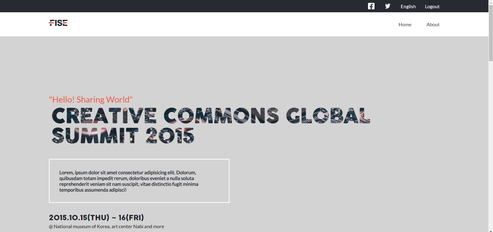

# CAPSTONE PROJECT [MODULE 1]

> This is a project preview for a website designed for industrial automation purposes, following the guidelines of the [Capstone project](https://github.com/microverseinc/curriculum-html-css/blob/main/capstone/html_capstone.md).



This project is built to simulate an industrial automation company's website, fully responsive, created dinamically using javascript and following the template from [Cindy Shin](https://www.behance.net/gallery/29845175/CC-Global-Summit-2015).

## Built With

- HTML, CSS, Javascript
- Bootstrap

## Live Demo

[GitHub pages deployment](https://maccrazyman.github.io/Capstone-module-1/)


## Getting Started


To get a local copy up and running follow these simple example steps.

### Prerequisites
* A functional computer with VS Code or any functional coding software.
* Git bash or any version control software.

### Setup
* Copy the repo link and clone it in your local machine
* You can execute the following command in your git bash:
    ```` 
    git clone https://github.com/MacCrazyman/Capstone-module-1.git 
    ````

### Usage
* Open the [index](./index.html) file with your browser to see the webpage.
* You can also open the [GitHub pages deployment](https://maccrazyman.github.io/Capstone-module-1/) to see a live version of the webpage.


## Authors

👤 **Leonardo Pareja**

- GitHub: [@MacCrazyman](https://github.com/MacCrazyman)
- Twitter: [@MacCrazyman](https://twitter.com/MacCrazyman)
- LinkedIn: [Leonardo Pareja](https://www.linkedin.com/in/leonardo-pareja-pareja/)


## 🤝 Contributing

Contributions, issues, and feature requests are welcome!

Feel free to check the [issues page](../../issues/).

## Show your support

Give a ⭐️ if you like this project!

## Acknowledgments

- This project was buil following a template from [Cindy Shin](https://www.behance.net/adagio07)
- Template has [CC license](https://creativecommons.org/licenses/by-nc/4.0/)

## 📝 License

This project is [MIT](./MIT.md) licensed.